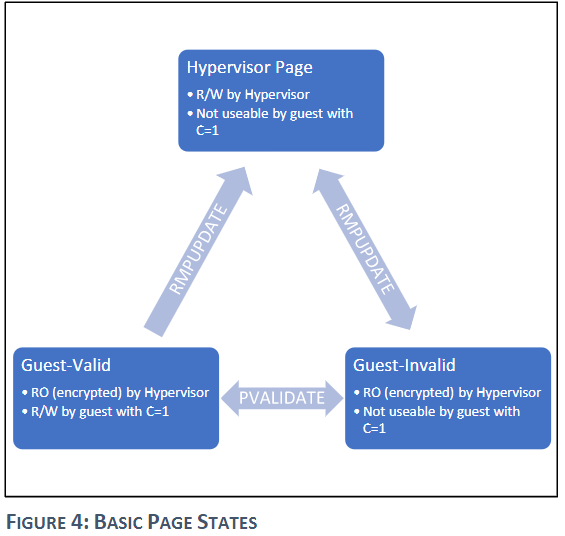

# AMD SEV-SNP

在AMD-ES中我们提到，对于寄存器状态系统是提供了完整性保护的，但是对于内存则没有做到这一点。虽然攻击的门槛或许会高一些，以块为单位的重放攻击，内存重映射等等依旧是一个威胁。为此，AMD提供了新的物件，SEV-SNP，在先前的基础上主要负责加装内存完整性防护这一新功能。此外，SNP也提供了其余种类的防护机制，一定程度上让侧信道攻击也不再那么容易执行。

Although an attacker cannot easily put known data into a VM's memory without knowledge of the encryption key, the may still be able to corrupt memory so that the VM sees random values or conduct replay attacks.

**Key principles for SNP:** SEV-SNP integrity is that if a VM is able to read a private (encrypted) page of memory, it must always read the value it last wrote.

So basically the memory owner VM is able to judge whether the integrity is compromised or not. Another way to understand it might be: **If the VM wrote a value A to memory location X, whenever it later reads X it must either see the value A or it must get an exception indicating the memory could not be read.**

Since Guest VM has two types of memory: unecrypted (shared) or encrypted (private), in fact the SEV-SNP only builds upon **encrypted memory.**

<figure><figcaption>
Threat Model
</figcaption></figure>

**Threat Model is shown above.** Basically the untrusted means these components are assumed to be malicious, potentially conspiring with other untrusted components in an effort to compromise the security guarantees of an SEV-SNP VM.

The SNP VM doesn't means the full VM is encrypted as a private one, it still contains the unecrypted (shared) memory part as we mentioned above. But the unecrypted memory won't compromise the security of SNP VM. That's the idea.

**Confidentiality:** SEV, SEV-ES features.

**Integrity:** SEV-SNP -> integrity attacks on memory, SEV-ES -> integrity attacks on Registers.

**Availability:**&#x20;

1\. Ensuring the hypervisor retains control of the system, the guest VM is not able to deny the hypervisor from running or otherwise render the physical machine unusable. -> SEV support this level of availability.&#x20;

2\. whether the guest enjoys any guarantees of availability such as a minimum run-time. -> don't care, since hypervisor is not trusted.

**Physical Access Attacks:** out of scope, these attacks are very complex and require a significant level of local access and resources to perform.

**Miscellaneous:** It seems SNP isn't specifically written to prevent side-channel attacks.

**etc. please refer to the whitepaper.**

#### **Integerity Threats:**&#x20;

The Integerity memory might suffer from basically consists of 4 types: Replay Protection, Data Corruption, Memory Aliasing, and Memory Re-Mapping.

The idea behind is form a one-to-one mapping between guest memory to physical memory, which somehow resists the hypervisor from attacking the guest.

#### Reverse Map Table: Every PA -> One gPA

The RMP is a single data structure shared across the system that contains one entry for every 4k page of DRAM that may be used by VMs.

The goal is simple: it tracks the owner for each page of memory.

<figure><figcaption>
RMP Tables
</figcaption></figure>

RMP Table: Every PA has an owner. The check tablewalk is shown above.

RMP has two ways of checking:

1. If the VA we checked is native, it simply using CR3 get the PA for the RMP to check.
2. If the VA we checked is in fact in a Guest VM, we'll use 2-level translation to get the PA for the RMP to check. RMP not only checks the ASID to find whether the belongings are right, but also check whether a PA only maps to a gPA. (**But not enssure that this gPA only matches with this PA**)

Note that not every memory access requires RMP check, only the one with SEV-SNP protection enabled will require RMP check. BTW, write accesses include both standard memory writes as well as A/D-bit updates as part of the page table walk. Like with standard x86 paging, the results of the RMP check are cached in the CPU TLB and related structures.

#### Page Validation: Every gPA -> One PA

Why?

**While the nested page tables ensure that each GPA can only map to one SPA, the hypervisor may change these tables at any time.**

Our threat model here take hypervisor as an attacker, so simply using RMP to ensure Intergrity is not enough.

The figure of Page States change is shown below:

<figure><figcaption>
Basic Page States
</figcaption></figure>

1. The hypervisor assigns the page to guest using **RMPUPDATE** instruction. The page will be into the Guest-Invalid state. With C = 1, which is encrypted and therefore read only by Hypervisor.
2. Guest validates the page using **PVALIDATE** instruction. The page will be into Guest-Valid state.

**To meet the desired integrity of SEV-SNP, the guest VM should never validate memory corresponding to the same GPA more than once.** Other than hot-plug events, VM can refuse any validatation behavior after boot time.

The combination of Page Validation and RMP will ensure the one2one mapping of PA & gPA.

<figure><figcaption>
Page Re-Mapping Attack
</figcaption></figure>

Taken Page remapping attack as an example.

1. Guest does PVALIDATE
2. Hardware sets RMP\[x].Validate = 1
3. Hypervisor allocates PA entry Y, using RMPUPDATE sets RMP\[Y].Validated=0
4. Hypervisor changes mapping in NPT, hoping gPA entry A->mapping to PA entry Y.
5. The Guest Refuses any Validation after boot time. So RMP\[Y].Validated keeps 0.
6. The hardware sees RMP\[Y].Validated = 0, causing a #VC exception.

#### Page states transition:

<figure><figcaption>
Page States
</figcaption></figure>

<figure><figcaption>
page transiition
</figcaption></figure>

The figure above shown the basic page states of SEV-SNP.&#x20;

