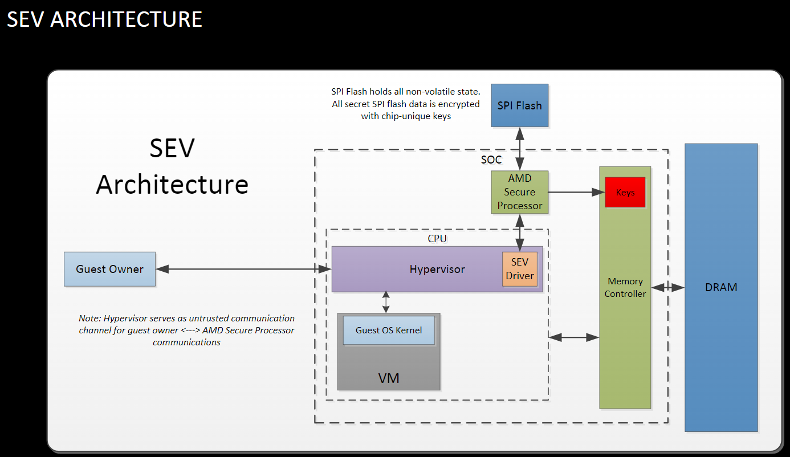

# x86 Memory Encryption

## From the talk in USENIX Security '16 & Xen projects & Linux Security Summit 2016.

SEV is an extension to the AMD-V architecture which supports running encrypted virtual machine under the control of KVM.

Each encrypted VM is associated with a unique encryption key.

**At least, I will go through all public files AMD offered.**

****

### AMD x86 Memory Encryption

#### Overview

**Motivation: Cloud usage**

1. Hypervisor must enforce full isolation between co-resident VMs.
2. Cloud users must fully trust the cloud hoster.

**Defend:**

can defend user access attacks and physical access attacks.

**How?**

Secure Memory Encryption & Secure Encrypted Virtualization

1. Hardware AES engine. -> for DRAM
2. Minimal performance impact. extra latency only taken for encrypted pages.
3. No applications changes required.
4. Encryption keys are managed by the AMD Secure Processor and are hardware isolated. They are not known to any softwares on the CPU.

To be detailed, OS/Hypervisor chooses pages to encrypt via page tables. This will prevent unpriviledged access to memory.

The Secure Memory Encryption process is shown below:

<figure><figcaption>
SME tech
</figcaption></figure>

**Briefly, it is the C-bit that counts.**

**Transparent SME**

enables memory encryption without OS modifications.

This will forces C-bit on all accesses, configured by AMD Secure Processor during boot x86 is released.

**SEV**

<figure><figcaption>
SEV overview
</figcaption></figure>

Hypervisor, guest VMs are seperateds cryptographically.

**SEV details**

1. Address Space ID(ASID) determines VM encryption key.
2. HW and Guest page tables determine if a page is private or shared
3. DMA must occur to shared pages

**The difference is shown below:**

<figure><figcaption>
comparison
</figcaption></figure>

**SEV Arch:**

<figure><figcaption>
SEV arch
</figcaption></figure>

The graph above shows the basic arch of SEV. Basically A memory Controller and a 32-bit AMD-SP are located in the SOC. The AMD-SP is the only one that has the access to the red part of the Memory Controller. The red part stores keys of Guest Owners which is the base of cryptographically isolation infrastructure of SEV.

An abstraction is provided for The Hypervisor to use some APIs to provide services for Guest VMs, and these services are enabled by the SEV Driver in it.

Since the Hypervisor is deemed as attackers, it serves as untrusted communication channel for guest owner and AMD SP communications. To avoid man-in-the-middle attack, more checks are embeded during these processes.

#### @Boot Time

The boot time process is well described in this pdf. Please focus on page 11 to 16. Bear it in mind!!

{% embed url="http://events17.linuxfoundation.org/sites/events/files/slides/AMD%20x86%20Memory%20Encryption%20Technology%20LSS%20Slides.pdf" %}

#### Key management

This part is also included in the video, when we have to do remote attestation, we should refer to this part.
